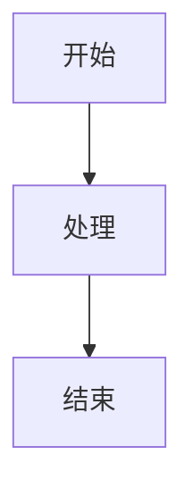

# 2. 编辑器：三模 + Markdown 语法

## 2.1 三种模式

KnowMe 编辑器有三个模式：

| 模式 | 特点 | 适用场景 | 切换 |
|---|---|---|---|
| **Live**（默认）| 所见即所得；光标当前行展开 markdown 源码，其它行渲染成成品 | 日常写作，快速反馈 | `Cmd+E` 在 Live ↔ Edit 切换 |
| **Edit** | 纯 markdown 源码，无渲染 | 调试格式、批量编辑、写大段代码 | 同上 |
| **Reading** | 纯渲染，不可编辑 | 阅读、检查最终效果、给别人演示 | `Cmd+Shift+E` |

底部右侧 MODE 区域有视觉切换按钮。

<!-- SCREENSHOT: 三种模式横向对比，每个截图标注模式名称。文件名建议：02-editor-three-modes-1.png -->

## 2.2 标题

```markdown
# 一级标题
## 二级标题
### 三级标题
```

Hover 到标题左侧会出现折叠箭头 `v`，点击折叠该章节内容（包括所有子章节直到下个同级或更高级标题）。

<!-- SCREENSHOT: 标题折叠/展开的演示。文件名建议：02-editor-heading-fold-1.png -->

## 2.3 列表

### 无序列表

```markdown
- 项目 A
- 项目 B
  - 子项 B1
  - 子项 B2
- 项目 C
```

`*`、`-`、`+` 都是无序 marker，效果一样。

### 有序列表

```markdown
1. 第一项
2. 第二项
   1. 嵌套子项
   2. 另一个子项
3. 第三项
```

KnowMe 在嵌套层级会自动循环 `1./a./i.` 三种 marker（仿 Obsidian），但源 markdown 仍用数字。

### 任务列表

```markdown
- [ ] 待办
- [x] 已完成
```

可以与有序列表组合：`1. [ ] 待办`。点击 checkbox 切换状态。

<!-- SCREENSHOT: 嵌套列表 + 任务列表的渲染效果，特别是 1./a./i. 循环。文件名建议：02-editor-list-rendering-1.png -->

### 折叠

任意有子项的列表项左侧 hover 会出现折叠箭头，可折叠该项及其所有后代。

## 2.4 文本格式

```markdown
**粗体**  *斜体*  ~~删除线~~  `行内代码`
```

行内 LaTeX 公式：`$E=mc^2$`，块级公式：

```markdown
$$
\sum_{i=1}^{n} i = \frac{n(n+1)}{2}
$$
```

## 2.5 代码块

带语言标识，自动用 [shiki](https://shiki.style) 高亮：

````markdown
```typescript
function hello(): void {
  console.log('hi')
}
```
````

代码块右上角有"复制"按钮。

<!-- SCREENSHOT: 代码块渲染（带语言标识 + 复制按钮）。文件名建议：02-editor-code-block-1.png -->

## 2.6 引用

```markdown
> 这是一段引用
> 多行引用
```

## 2.7 表格

```markdown
| 列 1 | 列 2 |
|------|------|
| A    | B    |
```

## 2.8 图片

支持本地图片：

```markdown

```

或 Obsidian 风格 wikilink：

```markdown
![[photo.png]]
```

也支持指定宽度：`![[photo.png|400]]`（400 px 宽）。

## 2.9 Mermaid 图

````markdown

````

<!-- SCREENSHOT: Mermaid 流程图渲染。文件名建议：02-editor-mermaid-1.png -->

## 2.10 查找 / 替换

按 `Cmd+F`（macOS）或 `Ctrl+F`（Windows / Linux）在编辑器顶部弹出查找面板，按 `Cmd+Alt+F` 打开查找替换。`Esc` 关闭。

支持区分大小写、正则、全词匹配三个开关。`Cmd+G` / `Cmd+Shift+G` 跳转下一个 / 上一个匹配。

<!-- SCREENSHOT: 查找替换面板顶栏。文件名建议：02-editor-find-replace.png -->
