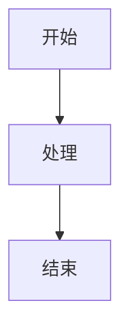

# 编辑与导出

知我的编辑器基于 CodeMirror 6,支持三种模式、Markdown + HTML 双格式、Obsidian 级的列表渲染、飞书风格的块操作,以及一键导出到微信公众号。

## 三种编辑模式

| 模式 | 特点 | 适用 | 切换 |
|---|---|---|---|
| **Live**（默认） | 所见即所得;光标行展开 Markdown 源码,其余行渲染成品 | 日常写作 | `⌘E` 在 Live ↔ Edit 切换 |
| **Edit** | 纯 Markdown 源码 | 调格式、写大段代码 | 同上 |
| **Reading** | 纯渲染,不可编辑 | 阅读、演示 | `⌘⇧E` |

右下角 MODE 区有切换按钮。不喜欢 Live 的可在[外观设置](/settings)关掉「实时编辑」,退回经典「编辑 ↔ 预览」。

<!-- SCREENSHOT[editor-three-modes.png]: Live / Edit / Reading 三种模式横向对比 -->

## Markdown 与 HTML 双格式

在知我里,**Markdown 和 HTML 都是一等公民**:

- **Markdown** 适合顺滑写作——标题、列表、链接、公式随手敲。
- **HTML** 适合精准排版——Markdown 表达不了的结构(自定义样式、复杂表格、嵌入块),可直接写 HTML,编辑器同样渲染。

同一篇笔记里两者可混用,导出时也会一并处理。

## Markdown 语法

### 标题

```markdown
# 一级标题
## 二级标题
```

Hover 标题左侧出现折叠箭头,点击折叠该章节(到下一个同级 / 更高级标题前)。

### 文本格式

```markdown
**粗体**  *斜体*  ~~删除线~~  `行内代码`
```

行内公式 `$E=mc^2$`,块级公式:

```markdown
$$
\sum_{i=1}^{n} i = \frac{n(n+1)}{2}
$$
```

### 代码块

带语言标识,自动用 [shiki](https://shiki.style) 高亮,右上角有「复制」按钮:

````markdown
```typescript
function hello(): void {
  console.log('hi')
}
```
````

### 图片

```markdown

![[photo.png]]
![[photo.png|400]]
```

支持本地路径、Obsidian wikilink 风格、指定宽度。

### Mermaid 图

````markdown

````

渲染后的 Mermaid 图**点击可放大到 lightbox** 查看(复杂流程图 / 时序图不必眯着眼看)。

### 表格 / 引用

```markdown
| 列 1 | 列 2 |
|------|------|
| A    | B    |

> 这是一段引用
```


## 列表与折叠

### 三种列表

```markdown
- 无序项
1. 有序项
- [ ] 待办
- [x] 已完成
```

`*` `-` `+` 都是无序 marker。点击复选框切换任务状态,已完成项灰化 + 删除线。

三种 marker(`•` / `1.` / `☐`)对齐到同一列,混排时视觉整齐。

### 嵌套与自动循环

子项每深一级缩进,左侧绘制淡灰竖线指向父项。嵌套有序列表**视觉上自动循环** `1. → a. → i.`(仿 Obsidian),但**源 Markdown 始终是数字**,复制 / 导出拿到的是标准 CommonMark。

光标在列表项上:`Tab` 缩进一级,`Shift+Tab` 减一级。

### 折叠

- **列表折叠**:有子项的列表项 hover 出现箭头,点击折叠该项及后代。
- **标题折叠**:对标题行同样生效,折叠到下一个同级标题前。
- **折叠状态持久化**:按文件记住,重启后保持。


## 高级编辑

知我借鉴飞书的块操作体验:

- **Slash menu** —— 在空行敲 `/` 唤出插入菜单,快速插入标题、列表、代码块、表格等。
- **Block handle** —— 块左侧的拖拽手柄,可拖动重排、对块做操作。
- **Columns（分栏）** —— 把内容排成多列,每列是独立的子编辑器。
- **Selection toolbar** —— 选中文字浮现工具栏,做格式化(以及 [问知我](/ai/collaboration))。
- **Wikilink 自动补全** —— 输入 `[[` 弹出已有词条搜索补全。


## 查找 / 替换

`⌘F`(macOS)/ `Ctrl+F` 打开查找,`⌘⌥F` 打开查找替换,`Esc` 关闭。支持**区分大小写 / 正则 / 全词匹配**三个开关;`⌘G` / `⌘⇧G` 跳下一个 / 上一个匹配。

## 导出到微信公众号

### 一键导出

1. 编辑器右上角点 **Export**。
2. 右侧打开导出预览面板。
3. 顶部选 **主题**。
4. 点 **Copy HTML** → 直接粘贴进公众号编辑器。

### 6 套内置主题

| 主题 | 风格 | 适用 |
|---|---|---|
| `classic` | 经典版式 | 通用、文字为主 |
| `classic-refined` | 经典 + 装饰 | 更有仪式感 |
| `elegant` | 米色 + 暖墨蓝 | 文学 / 散文 |
| `pill` | 胶囊 H1 + 圆角块 | 现代、IT 类 |
| `gradient` | 渐变标题 | 视觉冲击 |
| `book` | 书页式 | 长文连载 |

<!-- SCREENSHOT[export-wechat-themes.png]: 公众号导出预览，主题切换（6 套）-->

### 导出细节

- **KaTeX 公式** —— CSS 全部 inline 进元素,粘贴后视觉与知我内一致。
- **Mermaid 图** —— 导出时转成 PNG 内嵌(公众号支持的格式)。
- **本地图片** —— 自动转 base64 data URI 内嵌,无需另行上传(建议单图 < 1MB)。
- **Wikilink** —— 公众号不支持站内链接,活链 / 死链都退化为加粗文本。
- **完全本地** —— 导出不调任何远程 API,不上传内容。

### 其他渠道

**Markdown 导出**已支持。**小红书 / Medium / dev.to** 计划在 v1.x 添加。

## 接下来

- 让 AI 整理这些笔记 → [知识引擎](/core/knowledge-engine)
- 圈选问知我 / 评论 @知我 → [AI 协作](/ai/collaboration)
- 快捷键速查 → [快捷键](/reference/shortcuts)
